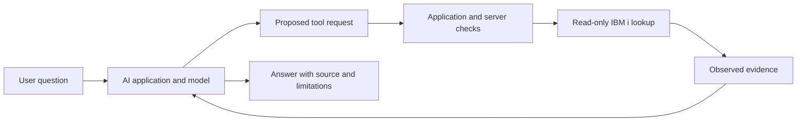

# Lesson 1 — Why MCP?

[Learning index](README.md) · [Previous: Roadmap](00-roadmap.md) · [Next: Lesson 2](lesson-02-mcp-architecture.md)

**Project connection:** explain why an IBM i assistant needs controlled access to real system evidence.

**Learning objectives:** distinguish model knowledge from live information, describe a tool-enabled application, explain what MCP standardizes, and identify what it does not guarantee.

## Opening question

An operator asks: “Is job `123456/DEMOUSER/NIGHTLY` still running on DEV?”

The model has no connection to DEV and no recent job output in its conversation. What evidence would it need before answering? Write one sentence before continuing.

All identifiers and observations in this lesson are fictional. These are paper exercises, not results from your system.

## 1. Why LLMs are not enough

A **large language model (LLM)** generates language using patterns learned during training and the information supplied in its current **context**: the material available while producing an answer.

It can explain what an IBM i job is. That does not establish the present state of a particular job on your partition. The model needs a recent observation from a suitable source.

Three gaps matter in our project:

| Gap | IBM i example | What the application needs |
| --- | --- | --- |
| Freshness | A job may have ended seconds ago | A current status read with an observation time |
| Access | Your application library is private | An authenticated, authorized path to the required information |
| Verification | A plausible object name may not exist | A result tied to the exact system, library, name, and type |

You could paste a status report into the chat. The model could reason about that report, but the report is a snapshot. Asking again later does not refresh it automatically.

The right response when evidence is missing is to say that the current state is unknown and identify the required lookup. Guessing “the job is active” would turn language fluency into an unsupported operational claim.

**English:** Explaining a system is different from observing its current state.

**Hinglish:** System ka concept samajhna aur uski current state dekhna alag cheezein hain; current answer ke liye fresh evidence chahiye.

## 2. Traditional LLM vs tool-enabled LLM

Here, a **traditional LLM application** means a prompt-and-response application with no external tool execution. A **tool** is an operation exposed by software through a defined interface, such as “read this job's status.”

| Aspect | Prompt-and-response application | Tool-enabled application |
| --- | --- | --- |
| Available evidence | Training knowledge and supplied context | Those sources plus results from permitted tools |
| Current IBM i status | Needs someone to supply a current report | Can request an authorized status lookup |
| Execution | Produces text | Application software executes a permitted tool request |
| Failure | May lack information | Must also handle access denial, timeouts, and incomplete results |

The model might propose `get_job_status` with a job identifier. Software checks and executes that request, then supplies the result to the model. Writing a command in a chat message does not itself execute it.

Tools do not automatically make answers correct. The application might inspect the wrong partition, return old data, or omit an error. The final explanation still needs to match the evidence.

**Prediction check:** If the status lookup times out, can the model conclude that the job has ended? Explain which fact the timeout actually establishes.

**English:** A model proposes a lookup; software executes it; the result becomes evidence for the answer.

**Hinglish:** Model lookup suggest karta hai, software checks ke baad chalata hai, aur result answer ka evidence banta hai.

## 3. Why MCP exists

An **API**, or application programming interface, defines how software requests a capability. You can build a tool-enabled application by integrating directly with APIs; MCP is not required for tool use.

Now imagine two chat applications that both need IBM i information, a document store, and an issue tracker. If every application invents its own way to describe and call each integration, teams repeat similar work.

**Model Context Protocol (MCP)** provides a shared protocol for AI applications to discover and use capabilities exposed by servers. It gives the application-to-server boundary common conventions. The official [MCP introduction](https://modelcontextprotocol.io/docs/2026-07-28/getting-started/intro) introduces this interoperability goal.

For MCP4i, we design one IBM i-facing server interface that compatible hosts can use. The server still needs an IBM i adapter: the part that translates our tool requests into supported system reads.

| Connection | Example responsibility |
| --- | --- |
| AI application ↔ MCP4i | Discover `get_object_info`; send its named arguments; receive a result |
| MCP4i ↔ IBM i | Locate an authorized object and retrieve its metadata through a supported interface |

MCP does not replace Db2 for i, create missing APIs, assign IBM i authority, or train the model on your system. Standardization reduces integration differences; compatibility and behavior still need testing.

**English:** MCP standardizes an integration boundary; the IBM i-specific work still belongs in our server and adapter.

**Hinglish:** MCP connection ka common contract deta hai; IBM i ka actual data access humein server aur adapter mein banana hoga.

## 4. MCP as “USB-C for AI”

The [official introduction](https://modelcontextprotocol.io/docs/2026-07-28/getting-started/intro) uses the USB-C analogy. Think of a common connector that lets different devices participate in a shared ecosystem.

In our project analogy:

- The AI application is the device that wants a capability.
- MCP is the common connection language.
- MCP4i is the adapter that exposes IBM i capabilities.
- IBM i remains the system supplying the information.

The analogy has limits. A familiar connector does not prove that an attached device is trustworthy, that it supports every feature, or that its user is allowed to access everything. Likewise, an MCP connection still needs compatible versions, supported capabilities, authorization, and correct implementation.

**Explain back:** If someone says “MCP makes any database safe for AI,” which part of the analogy have they stretched too far?

**English:** A common connector helps systems work together; it does not guarantee access or correctness.

**Hinglish:** Common connector integration aasaan karta hai; permission aur correctness ki guarantee nahi deta.

## 5. IBM i examples and a paper demo

Our first phase answers inspection questions. It does not repair or change the target system.

| User question | Planned capability | Important limit |
| --- | --- | --- |
| “Which partition answered?” | `get_system_info` | Report observed identity; do not invent unavailable fields |
| “Which libraries are in this connection's library list?” | `get_library_list` | Name the job or connection context |
| “Who owns APPLIB/ORDERS of type *FILE?” | `get_object_info` | Require a qualified, authorized target |
| “Which objects are recorded as references for APPLIB/ORDENT?” | `get_program_references` | Recorded references may not describe every runtime dependency |
| “What is this job's status?” | `get_job_status` | Use a complete job identifier and observation time |
| “Show a small set of approved order data.” | `run_sql`, later in Phase 1 | Restricted read-only SQL and approved data only |

The [project roadmap](../project/phase-01-readonly-tools.md) defines the full catalogue and these limits.

### Walk through one answer

1. The user asks about `123456/DEMOUSER/NIGHTLY` on DEV.
2. The application proposes the named status tool with that identifier.
3. The server verifies the configured target and the caller's access.
4. The backend returns a fictional observation: status `ACTIVE`, system DEV, observed at `2026-09-15T09:30:00Z`.
5. A suitable answer is: “DEV reported this job as ACTIVE at 09:30 UTC. This is a point-in-time observation.”

That observation does not establish that the job is healthy, making progress, or certain to complete. Those are different questions requiring different evidence.

**Mini demo:** Repeat the trace with “permission denied” as the tool result. Write the final user-facing answer without inventing a job status or asking the model to bypass the restriction.

**English:** A useful IBM i answer preserves the target, observation time, and limits of the returned data.

**Hinglish:** Useful IBM i answer mein target, observation time, aur data ki limits clear honi chahiye.

## Summary

**English:** LLMs reason over available context. Tools let applications obtain additional evidence through controlled operations. MCP standardizes how compatible applications connect to servers exposing those capabilities. MCP4i will apply that model to read-only IBM i inspection.

**Hinglish:** LLM available context par reason karta hai. Tools controlled tareeke se naya evidence laate hain. MCP compatible apps aur servers ke beech common protocol hai. MCP4i mein hum isi approach se IBM i ki information read karenge.

## Homework

Use your own words and fictional names. Do not implement anything.

1. **Problem statement:** In 100–150 words, describe one IBM i support question, its intended user, the evidence needed, and how a wrong answer could waste their time.
2. **Compare approaches:** For that question, compare a prompt-only answer, a manually pasted report, and an authorized tool lookup. Explain freshness and access in each case.
3. **Explain MCP:** Give a four-sentence explanation to a colleague who knows APIs but has not used MCP. Include one useful part and one limitation of the USB-C analogy.
4. **Draw a flow:** Show how `get_object_info` could produce an evidence-based answer. Mark who proposes the request, who checks it, and who reads the target.
5. **Set the boundary:** Give three read-only questions and two requests that Phase 1 must reject. Explain each choice.

### Review checks

- [ ] You distinguish learned knowledge, supplied context, and a live observation.
- [ ] You explain that ordinary API integrations can also support tool use.
- [ ] You assign execution to software rather than to generated text.
- [ ] You explain why MCP alone does not grant authority or guarantee a safe result.
- [ ] Your example answer handles missing evidence honestly.

**Delayed recall:** At the start of your next session, answer: “If a model can explain `DSPPGMREF`, why can't it list my current program references without additional evidence?”

These checks require review; they are not marked passed by reading the lesson.

## Reading and video guide

| Topics to revisit | Primary reading | Video focus |
| --- | --- | --- |
| Model limitations, tool use, and the integration problem | [MCP introduction](https://modelcontextprotocol.io/docs/2026-07-28/getting-started/intro) | “Why MCP” — notice which missing information an integration supplies |
| The common-connector analogy and its limits | [MCP architecture: scope](https://modelcontextprotocol.io/docs/2026-07-28/learn/architecture#scope) | “Why MCP” — explain what becomes reusable |
| Apply the ideas to IBM i | [IBM i Services overview](https://www.ibm.com/docs/ssw_ibm_i_75/rzajq/rzajqservicessys.htm) | “MCP Architecture” — replace the course's backend mentally with IBM i |

The video sections are in [DeepLearning.AI and Anthropic's original MCP course](https://www.deeplearning.ai/courses/mcp-build-rich-context-ai-apps-with-anthropic), taught by Elie Schoppik. The course lists “Why MCP” as 7 minutes and “MCP Architecture” as 14 minutes. Enrollment or sign-in may be required; the page advertises limited-time free access, and paid features may differ. The linked primary documentation is publicly readable.

Next: [Lesson 2 — MCP Architecture](lesson-02-mcp-architecture.md).
