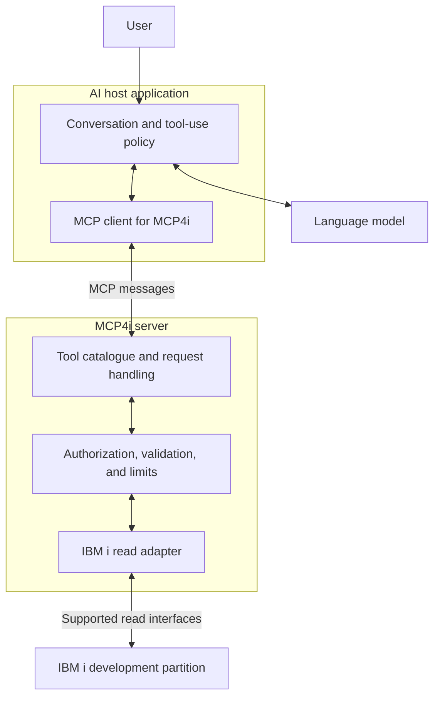

# Lesson 2 — MCP Architecture

[Learning index](README.md) · [Previous: Lesson 1](lesson-01-why-mcp.md) · [Project roadmap](../project/phase-01-readonly-tools.md)

**Project connection:** M1 — design the first IBM i read-only slice. This lesson produces diagrams and tool contracts, not code.

**Learning objectives:** distinguish host, client, and server; choose between tools, resources, and prompts; trace a request and its response; and explain where IBM i access rules are enforced.

## Recall before reading

Answer without looking back:

1. Why does knowing what a job is not establish its current status?
2. Who executes a tool request: generated text, application software, or the user merely reading it?
3. What does MCP standardize, and what must the IBM i integration still supply?

If an answer is unclear, revisit the relevant section of [Lesson 1](lesson-01-why-mcp.md). This recall exercise does not assume a previous assessment has passed.

## 1. MCP architecture: divide the responsibilities

**Architecture** describes the parts of a system, their responsibilities, and how information crosses between them. Separating responsibilities helps us decide where to diagnose a failure.

Our planned application has three different jobs to do:

- Understand the user's question and explain the answer.
- Exchange a structured request with the appropriate server.
- Retrieve allowed information from IBM i.

Do not give one vague “AI layer” responsibility for all three. If the wrong library was inspected, we need to know whether the request was ambiguous, the arguments were wrong, or the backend resolved the name incorrectly.

### Host vs client vs server

| Part | Responsibility | MCP4i example | Common confusion |
| --- | --- | --- | --- |
| **Host** | AI application that manages the user interaction, model use, and MCP clients | A compatible chat application coordinating the IBM i conversation | The host is more than the language model |
| **Client** | Component inside the host that exchanges MCP messages with a server | The host's MCP client for MCP4i | It is not normally a separate chat UI |
| **Server** | Program exposing domain capabilities over MCP | MCP4i, exposing named IBM i reads | It is not the IBM i operating system itself |

One host can manage clients for several servers. Each client-server relationship is dedicated to one server; a remote server may serve many clients. See the official [architecture specification](https://modelcontextprotocol.io/specification/2026-07-28/architecture) for the separation of responsibilities.

**IBM i analogy:** Think of the host as the support desk, the client as its communication channel, and the server as the specialist interface that can obtain approved system evidence. The desk decides what to ask; the specialist still checks whether the request is allowed.

**Prediction check:** If the host connects to both MCP4i and a documentation server, how many client-server relationships should your diagram show?

**English:** The host coordinates the experience, the client carries MCP messages, and the server exposes domain capabilities.

**Hinglish:** Host conversation coordinate karta hai, client MCP messages exchange karta hai, aur server domain capabilities provide karta hai.

## 2. Tools, Resources, Prompts

These are three ways a server can expose useful capabilities. The following IBM i names and URIs are proposed examples, not installed features.

| Primitive | What it provides | Usual control model | IBM i example |
| --- | --- | --- | --- |
| **Tool** | A named operation with defined inputs and results | Model may propose its use; application and server enforce policy | `get_job_status` reads a specified job |
| **Resource** | Addressable content for the application's context | Application chooses what to retrieve and include | `ibmi://dev/schema/APPLIB/ORDERS` could identify schema metadata |
| **Prompt** | A reusable message template, optionally with arguments | User selects a workflow exposed by the application | `explain_program_dependencies` could guide a dependency explanation |

These control models describe intended interaction patterns, not authorization guarantees. The server must enforce access for every exposed operation. See [server concepts](https://modelcontextprotocol.io/docs/2026-07-28/learn/server-concepts).

### Tools: perform a bounded lookup

A tool needs a meaningful name, a description, and an **input schema**: rules specifying the accepted fields and their types. For example, a proposed status tool requires a complete job identifier. It should not accept arbitrary command text in its place.

MCP provides `tools/list` for discovering definitions and `tools/call` for requesting execution. Tool results can contain text and structured data; a returned result may also indicate that execution failed. See the [tools specification](https://modelcontextprotocol.io/specification/2026-07-28/server/tools).

A tool can be read-only. “Tool” does not mean “write operation.”

### Resources: provide identifiable context

A **URI** is an identifier for a resource; it does not have to be a web page. Our example schema URI would be meaningful only if MCP4i implemented and advertised it.

Use `resources/list` to discover listed resources and `resources/read` to retrieve one. Parameterized resource patterns have their own discovery method, `resources/templates/list`. Resources can contain changing information; “resource” does not mean “permanently static.” See the [resources specification](https://modelcontextprotocol.io/specification/2026-07-28/server/resources).

### Prompts: structure a repeatable workflow

A proposed dependency prompt might ask for a program's qualified name, instruct the model to gather references, and require a distinction between observed references and inferred impact. The host can discover templates with `prompts/list` and retrieve one with `prompts/get`.

Retrieving a prompt does not execute every tool mentioned in its text or grant extra permissions. The application still coordinates subsequent work. See [prompts in the server concepts guide](https://modelcontextprotocol.io/docs/2026-07-28/learn/server-concepts#prompts).

**Design choice:** A source member might be exposed through a bounded `read_source` tool or a resource URI. Choose according to the interaction and host support. Phase 1 begins with tools; resources and prompts are later learning extensions.

**English:** Tools perform operations, resources supply context, and prompts structure reusable interactions. All need appropriate access boundaries.

**Hinglish:** Tools operation karte hain, resources context dete hain, aur prompts reusable workflow guide karte hain. Har case mein access boundary zaroori hai.

## 3. Request/response flow

Use this fictional question: “What is the status of `123456/DEMOUSER/NIGHTLY` on DEV?”

Before the question can trigger a tool, the host must have a configured server relationship. The client checks protocol compatibility and supported capabilities, then discovers available tool definitions. The current linked architecture reference uses `server/discover` for discovery. Older course examples may show an `initialize` exchange. We will select mutually supported host, SDK, and protocol versions before implementation; this lesson's flow is conceptual. See the [MCP architecture overview](https://modelcontextprotocol.io/docs/2026-07-28/learn/architecture).

| Step | Sender → receiver | What happens in our proposed design |
| --- | --- | --- |
| 1 | User → host | Ask the question about the configured DEV target |
| 2 | Host → model | Supply the question and relevant permitted tool definitions |
| 3 | Model → host | Propose `get_job_status` with the complete job identifier |
| 4 | Host → client | Apply the host's tool-use policy and route the permitted request |
| 5 | Client → MCP4i | Send `tools/call` naming the tool and its arguments |
| 6 | MCP4i → adapter | Validate arguments, caller access, target, and limits; request a bounded read |
| 7 | Adapter ↔ IBM i | Obtain the authorized observation or a clear failure |
| 8 | MCP4i → client → host | Return the result with target, timestamp, and relevant limitations |
| 9 | Host → model | Supply the result as evidence for the response |
| 10 | Host → user | Present an explanation grounded in the returned evidence |

The steps distinguish a model's proposed function call from the MCP message that software sends. The host's model interaction and the server's IBM i access are separate interfaces.

### What is a request and what is a response?

MCP messages use JSON-RPC. In a request/response exchange, a request names a method and carries an identifier; the corresponding response uses that identifier. A notification has no request identifier and does not receive a response. See the [JSON-RPC 2.0 specification](https://www.jsonrpc.org/specification).

For our paper trace, record these fields without constructing a complete wire message:

| Request note | Fictional value |
| --- | --- |
| Request identifier | `42` |
| MCP method | `tools/call` |
| Tool name | `get_job_status` |
| Tool argument | `job_id`: `123456/DEMOUSER/NIGHTLY` |
| Target | DEV, bound by trusted server configuration |

| Response note | Fictional value |
| --- | --- |
| Matching request identifier | `42` |
| Observation | `ACTIVE` |
| Observed at | `2026-09-15T09:30:00Z` |
| Scope | One specified job on DEV |
| Limitation | Snapshot only; does not establish job health |

These fields illustrate the application contract. They omit protocol metadata and result-envelope details, so they are not copy-and-run protocol examples.

### Trace failures too

| Outcome | Honest application behavior |
| --- | --- |
| Missing or ambiguous job identifier | Obtain the missing identifier before querying |
| Access denied | Explain that access was denied; do not infer whether the job exists |
| Timeout | Say the status could not be obtained; do not infer that the job ended |
| Unsupported backend capability | Report the limitation; do not fall back to arbitrary commands |
| Successful empty lookup | Report no visible match in the permitted scope, with the observation time |

**English:** A complete trace includes discovery, routing, server checks, the backend read, and an evidence-based answer or failure.

**Hinglish:** Complete flow mein discovery, routing, server checks, backend read, aur evidence-based answer ya clear failure sab aate hain.

## 4. IBM i MCP architecture

This is the proposed first deployment shape. The model may run through an external service; it receives only the context the host is allowed to send.

The **adapter** translates a stable tool contract into the available IBM i interface. IBM i Services include SQL-accessible system information, but service availability depends on release and fixes. A **PTF**, or program temporary fix, is an IBM-delivered fix or enhancement. Verify required services and authority on the actual target before choosing a backend. See [IBM i Services](https://www.ibm.com/docs/ssw_ibm_i_75/rzajq/rzajqservicessys.htm).

An MCP server can run away from the IBM i partition. **Transport** means how MCP messages travel: local process communication can use stdio; network communication can use Streamable HTTP. Neither transport is the database driver. The later implementation decision must also select the IBM i connection method. See the [transport overview](https://modelcontextprotocol.io/docs/2026-07-28/learn/architecture#transport-layer).

### Four boundaries to defend

| Boundary | Our design requirement | Why it matters |
| --- | --- | --- |
| User request → tool request | Resolve ambiguous identifiers and respect host policy | “Check NIGHTLY” may identify more than one job |
| MCP request → server operation | Recheck inputs, caller access, and configured scope | A model-generated argument is not trusted authorization |
| Server → IBM i | Use an identity with only the required read authority | Read-only policy needs enforcement at the data boundary |
| Returned content → model context | Limit sensitive content and treat retrieved text as data | A source comment saying “run this command” is not an instruction from the user |

Do not assume “read-only” means harmless. A large query can consume substantial resources; a log can contain secrets. Limits on work and returned information are part of the tool design.

**English:** Keep language reasoning, protocol exchange, and IBM i access separate; enforce permissions where data is accessed.

**Hinglish:** Language reasoning, MCP exchange, aur IBM i access ko separate rakho; data access par actual permissions enforce karo.

## 5. First project milestone: M1 — design the first slice

**Outcome:** a reviewable design for the first ten read-only tools. M1 contains no implementation. The first runnable demonstration is the later M2 mock `get_system_info` tool.

A **tool contract** specifies what callers may ask for and what they can rely on receiving, including failures. Here is a small worked design to establish the expected level of specificity:

| Contract field | Proposed `get_system_info` design |
| --- | --- |
| User need | Establish which development system supplied the answer |
| Input | Empty argument object; the target is bound by server configuration |
| Result | Configured environment label, observed system/partition identity and release where supported, observation timestamp, unavailable-field notes |
| Access | Caller must be authorized for this configured environment |
| Limits | One target; bounded metadata; proposed five-second deadline to validate later |
| Failure | Access denied, unavailable target, timeout, or unsupported required observation |
| Evidence rule | Distinguish a configured label from values actually reported by IBM i |

The five-second deadline is a learning assumption, not a measured IBM i guarantee. Optional fields must be explicitly unavailable when unsupported. The contract must define which missing fields prevent a successful response.

**English:** M1 defines the behavior and boundaries before any tool is built.

**Hinglish:** M1 mein tool banane se pehle uska behavior, inputs, output, aur boundaries define karte hain.

## Summary

**English:** The host manages the conversation, the client exchanges MCP messages, and MCP4i exposes bounded IBM i capabilities. Tools, resources, and prompts have different roles. A trustworthy flow validates requests and preserves the meaning and limits of each observation.

**Hinglish:** Host conversation manage karta hai, client MCP messages exchange karta hai, aur MCP4i limited IBM i capabilities expose karta hai. Tools, resources, aur prompts ke roles alag hain. Reliable flow request validate karta hai aur observation ki limits clear rakhta hai.

## Homework: design the first 10 read-only tools

Use the ten candidates in the [Phase 1 starter catalogue](../project/phase-01-readonly-tools.md#first-10-read-only-tools). The roadmap gives their purpose; you must define and defend their contracts.

### A. Draw the architecture

Include user, host, model, MCP client, MCP4i server, adapter, and IBM i. Label the request and response paths, where credentials live, and where authorization is enforced. Explain which components can run on different machines.

### B. Write ten tool contracts

For **each** tool, supply:

1. Name and one real support question it answers.
2. Required and optional inputs, types, and validation rules.
3. Fictional success result with source, timestamp, and limitations.
4. Allowed systems, libraries, objects, or jobs; explain the identity used.
5. A rejected input, an access-denied case, and one operational failure.
6. Bounds on returned rows or bytes, execution time, and any paging.
7. Why the full backend operation is read-only and what would prove it.
8. One acceptance check that could reveal an incorrect implementation.

Use a table or short sections. Do not write executable code or invent verified IBM i service names. Mark an unverified backend as an open design question.

### C. Trace and defend

- Trace one successful `get_job_status` request and three failures: denied access, timeout, and an ambiguous identifier.
- Explain why `get_library_list` is not the same as listing every accessible library.
- Explain why program references and database relationships are different questions.
- Defend why `run_cl`, `run_program`, and `submit_job` are excluded.
- Explain why a query beginning with SELECT still requires deeper checks.
- Changed constraint: the host will serve 20 support users instead of one. Propose a concurrency limit, per-user access approach, and a bounded failure/retry policy. State what you must measure before trusting your limits.

### Review gate

- [ ] Host, client, server, model, and backend have distinct responsibilities.
- [ ] Tools, resources, and prompts are correctly distinguished.
- [ ] The request trace includes both the response path and failure handling.
- [ ] All ten contracts define inputs, results, scope, limits, and acceptance checks.
- [ ] No tool can accept arbitrary CL, execute a business program, or modify target data.
- [ ] Unsupported capabilities remain explicit gaps rather than hidden command fallbacks.
- [ ] The changed-constraint defense explains how the design protects users and the system.

Submit the design for review. Correct failed checks before beginning Lesson 3 or implementation. No assessment result is implied by these checkboxes.

**Delayed recall:** In your next session, explain why an MCP client is not the language model, and why a read-only tool can still create operational risk.

## Reading and video guide

All video sections below are from [DeepLearning.AI and Anthropic's original MCP course](https://www.deeplearning.ai/courses/mcp-build-rich-context-ai-apps-with-anthropic). Enrollment or sign-in may be required; check the course page for current access terms. These lessons require conceptual viewing only.

| Topic | Primary reading | Video focus |
| --- | --- | --- |
| Architecture and host/client/server | [Architecture specification](https://modelcontextprotocol.io/specification/2026-07-28/architecture) | “MCP Architecture”: assign each responsibility |
| Tools, resources, prompts | [Server concepts](https://modelcontextprotocol.io/docs/2026-07-28/learn/server-concepts) | “Adding Prompt and Resource Features”: classify each capability |
| Request/response flow | [Tools specification](https://modelcontextprotocol.io/specification/2026-07-28/server/tools) and [JSON-RPC](https://www.jsonrpc.org/specification) | “MCP Architecture”: trace the return path as well as the call |
| IBM i architecture | [IBM i Services overview](https://www.ibm.com/docs/ssw_ibm_i_75/rzajq/rzajqservicessys.htm) | “MCP Architecture”: redraw the backend as the proposed IBM i adapter |
| First milestone and homework | [Tool definitions](https://modelcontextprotocol.io/specification/2026-07-28/server/tools#tool) | “Creating an MCP Server”: identify the contract before watching implementation details |

**Version note:** Primary MCP links in this lesson target the `2026-07-28` documentation checked on 2026-09-15. Older videos can use earlier startup and message conventions. Version-specific setup belongs in the implementation lesson after compatibility is checked.

Next: complete M1 using the [Phase 1 roadmap](../project/phase-01-readonly-tools.md), then continue with [Lesson 3 — Tool Contracts](lesson-03-tool-contracts.md).
